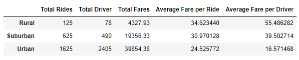
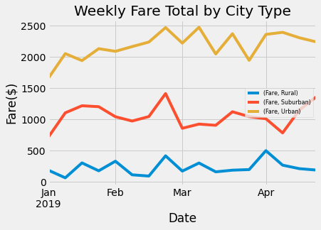

# PyBer_Analysis

Purpose: The CEO, V. Isiulize requested a summry dataframe containing the key metrics: total rides, total drivers, total fares, average fare per ride, and average fare per driver, all by city type. You can see how the data distribution in the image. The rural areas had fewer rides, but larger fares compared to suburban and urban cities.

Pyber gave me two data files to analyze. One file contained metrics pertaining to each city, the	driver count, and the city type (rural, urban, suburban). The other contained the metrics city,	date,	fare,	and rides. In order to provide the summary requested these files had to be merged into one dataframe (pyber_data_df). Then I extracted: Total Rides,	Total Driver,	Total Fares	Average, Fare per Ride, and	Average Fare per Driver. With each new piece of data calculated I produced the summary dataframe (pyber_summary_df).

From the pyber_data_df dataframe I pulled the data(weekly fares by city type) needed to produce the line graph. 

